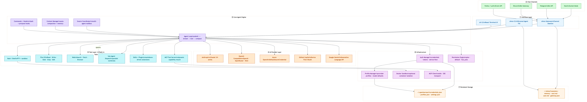

# OpenHarness — System Architecture

A system-level view of all major components, layers, and data flows.



---

## Layer Overview

| # | Layer | Components | Purpose |
|---|-------|-----------|---------|
| ① | **Interface** | `oh` CLI/TUI, `ohmo` TUI, Gateway Daemon | User-facing entry points |
| ② | **Chat Channels** | Slack, Telegram, Discord, Feishu | Remote access via messaging platforms |
| ③ | **Core Agent Engine** | Agent Loop, Swarm, Context Manager, Commands/Hooks | Orchestrates all reasoning and tool use |
| ④ | **AI Provider Layer** | Anthropic, OpenAI-compatible, Azure OpenAI, Copilot, Gemini | Interchangeable LLM backends |
| ⑤ | **Tool Layer** | 43 built-in tools: Bash, File I/O, Web, Sub-Agent, Skills, MCP | Execution capabilities |
| ⑥ | **Infrastructure** | Auth, Profiles, Docker Sandbox, MCP Client, Permissions | Supporting services |
| ⑦ | **Persistent Storage** | `~/.openharness/`, `~/.ohmo/` | Credentials, sessions, memory, personality |

---

## Key Data Flows

### Direct Agent (`oh`)
```
User → oh CLI → Agent Loop → Provider (LLM) → Tool Execution → Response
```

### Personal Agent via Channel (`ohmo`)
```
Slack / Telegram / Discord / Feishu
    → ohmo Gateway Daemon
        → Agent Loop (per session_key = channel:chat_id:thread_id)
            → Provider (LLM)
            → Tools
        → Reply streamed back to channel
```

### Multi-Agent (Swarm)
```
Agent Loop → Swarm Coordinator → spawns Sub-Agents (git worktrees)
    → each Sub-Agent runs its own Agent Loop
    → results merged back via mailbox
```

---

## Provider Authentication

| Provider | Auth Method | Key Env Var |
|----------|-------------|-------------|
| Anthropic | API Key | `ANTHROPIC_API_KEY` |
| OpenAI | API Key | `OPENAI_API_KEY` |
| Azure OpenAI | `DefaultAzureCredential` (Entra ID) | `ENDPOINT_URL` |
| GitHub Copilot | Device Flow OAuth | `oh auth copilot-login` |
| Gemini | API Key | (via profile) |

Active profile: `OPENHARNESS_ACTIVE_PROFILE` or `oh provider use <name>`

---

## Mermaid Source

```mermaid
%%{init: {'theme': 'base', 'themeVariables': {'fontSize': '15px', 'primaryColor': '#e7f5ff', 'lineColor': '#495057'}}}%%
graph TB

    subgraph ui["① Interface Layer"]
        CLI["oh CLI\nReact Terminal UI"]
        OHMO["ohmo CLI\nPersonal Agent TUI"]
        GWD["ohmo Gateway\nChannel Daemon"]
    end

    subgraph channels["② Chat Channels"]
        SLACK["Slack\nSocket Mode"]
        TG["Telegram\nBot API"]
        DISC["Discord\nBot Gateway"]
        FEI["Feishu / Lark\nEvent API"]
    end

    subgraph engine["③ Core Agent Engine"]
        LOOP["Agent Loop\nsubmit → stream → tool → compact"]
        SWARM["Swarm Coordinator\nmulti-agent mailbox"]
        CTX["Context Manager\nauto-compaction + memory"]
        CMD["Commands + Hooks\n/slash • pre/post hooks"]
    end

    subgraph providers["④ AI Provider Layer"]
        ANT["Anthropic\nClaude 3/4 series"]
        OAIC["OpenAI-Compatible\nOpenAI · OpenRouter · Kimi"]
        AZUR["Azure OpenAI\nDefaultAzureCredential"]
        COPIL["GitHub Copilot\nDevice Flow OAuth"]
        GEMINI["Google Gemini\nGenerative Language API"]
    end

    subgraph toolbox["⑤ Tool Layer: 43 Built-in Tools"]
        BASH["Bash / Shell\nPTY + sandbox"]
        FILES["File I/O\nRead · Write · Glob · Grep · Edit"]
        WEB["Web\nSearch · Fetch · Browser"]
        AGNT["Sub-Agent Dispatch\nparallel worktrees"]
        SKLS["Skills + Plugins\nmarkdown-driven extensions"]
        MCPT["MCP Tool Servers\ndynamic capability mount"]
    end

    subgraph infra["⑥ Infrastructure"]
        AUTH["Auth Manager\ncredentials · tokens · device-flow"]
        PROF["Profile Manager\nprovider profiles · model defaults"]
        SNDBX["Docker Sandbox\noptional container isolation"]
        MCPC["MCP Client\nstdio · SSE transport"]
        PERM["Permission Engine\nplan · default · full_auto"]
    end

    subgraph store["⑦ Persistent Storage"]
        OHSTORE["~/.openharness/\ncredentials.json · profiles.json · settings.json"]
        OHMOSTORE["~/.ohmo/\nsessions · memory · soul.md · user.md · gateway.json"]
    end

    SLACK --> GWD
    TG    --> GWD
    DISC  --> GWD
    FEI   --> GWD
    GWD   --> LOOP
    CLI   --> LOOP
    OHMO  --> LOOP
    SWARM --> LOOP
    CTX   --> LOOP
    CMD   --> LOOP
    LOOP  --> ANT
    LOOP  --> OAIC
    LOOP  --> AZUR
    LOOP  --> COPIL
    LOOP  --> GEMINI
    LOOP  --> BASH
    LOOP  --> FILES
    LOOP  --> WEB
    LOOP  --> AGNT
    LOOP  --> SKLS
    LOOP  --> MCPT
    MCPT  --> MCPC
    BASH  --> SNDBX
    AGNT  -.->|spawns| LOOP
    LOOP  --> AUTH
    LOOP  --> PERM
    AUTH  --> PROF
    AUTH  --> OHSTORE
    PROF  --> OHSTORE
    GWD   --> OHMOSTORE
    OHMO  --> OHMOSTORE

    classDef uiStyle     fill:#e7f5ff,stroke:#1971c2,color:#1864ab,font-weight:bold
    classDef chanStyle   fill:#d3f9d8,stroke:#2f9e44,color:#1e7e34,font-weight:bold
    classDef engineStyle fill:#e5dbff,stroke:#5f3dc4,color:#4a2d9e,font-weight:bold
    classDef provStyle   fill:#ffe8cc,stroke:#d9480f,color:#b84b0a,font-weight:bold
    classDef toolStyle   fill:#c5f6fa,stroke:#0c8599,color:#0a6b7a,font-weight:bold
    classDef infraStyle  fill:#f3d9fa,stroke:#862e9c,color:#6a2483,font-weight:bold
    classDef storeStyle  fill:#fff4e6,stroke:#e67700,color:#b85c00,font-weight:bold

    class CLI,OHMO,GWD uiStyle
    class SLACK,TG,DISC,FEI chanStyle
    class LOOP,SWARM,CTX,CMD engineStyle
    class ANT,OAIC,AZUR,COPIL,GEMINI provStyle
    class BASH,FILES,WEB,AGNT,SKLS,MCPT toolStyle
    class AUTH,PROF,SNDBX,MCPC,PERM infraStyle
    class OHSTORE,OHMOSTORE storeStyle
```



---

*Generated from source — re-render with:*
```bash
mmdc -i docs/system-architecture.mmd -o docs/system-architecture.png -w 3200 -H 4200 -s 3 --backgroundColor white
sips -s format pdf docs/system-architecture.png --out docs/system-architecture.pdf
```
